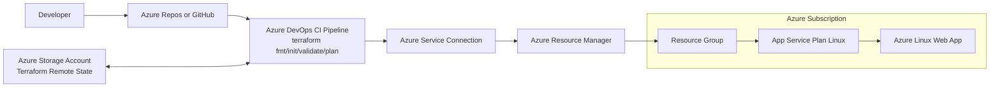

# Azure App Service Terraform + Azure DevOps CI

This repository provisions an Azure dotnet Linux Web App (App Service) using Terraform and validates infrastructure changes through an Azure DevOps CI pipeline.

## Folder Structure

- `infra/terraform` - Terraform code for Azure resources
- `pipelines` - Azure DevOps YAML pipelines
- `docs` - Architecture diagram and documentation

## Quick Start

1. Update values in `infra/terraform/terraform.tfvars`.
2. Update backend settings in `infra/terraform/providers.tf`.
3. Update service connection name in `pipelines/azure-pipelines.yml`.
4. Commit and push to your Git project.

## Local Terraform Commands

```bash
cd infra/terraform
terraform init
terraform fmt -recursive
terraform validate
terraform plan -out=tfplan
```

# Azure App Service with Terraform CI Architecture



