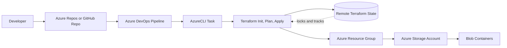
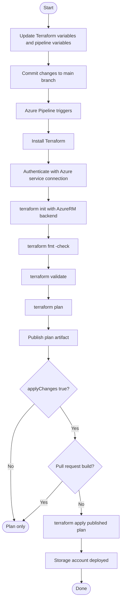

# Azure Storage Account With Terraform and Azure Pipelines

This tasks provisions an Azure Storage Account with Terraform and deploys it through Azure DevOps using `azure-pipelines.yml`.

## Architecture Background

The deployment creates a dedicated Azure resource group, one StorageV2 account, and one or more private blob containers. The storage account is configured with secure defaults for a general-purpose workload: HTTPS-only traffic, TLS 1.2 minimum, disabled nested public access, infrastructure encryption, and soft delete retention for blobs and containers.

Terraform state is stored in a separate, pre-created Azure Storage backend. That backend is intentionally separate from the storage account managed by this project so the pipeline can safely track infrastructure changes across repeated runs.



## Task Flowchart



## Repository Layout

```text
.
|-- .azuredevops/
|   `-- templates/
|       `-- install-terraform.yml
|-- infra/
|   `-- terraform/
|       |-- main.tf
|       |-- outputs.tf
|       |-- terraform.tfvars
|       |-- variables.tf
|       `-- providers.tf
|-- azure-pipelines.yml
|-- .gitignore
`-- README.md
```

## Prerequisites

- Azure subscription access.
- Azure DevOps project and pipeline.
- Azure service connection with permission to create resource groups and storage accounts.
- A pre-created Azure Storage container for Terraform state.


## Configure The Pipeline

Update these values in `azure-pipelines.yml`:

```yaml
azureServiceConnection: YOUR-AZURE-SERVICE-CONNECTION
tfStateResourceGroup: YOUR-TFSTATE-RESOURCE-GROUP
tfStateStorageAccount: YOURTFSTATESTORAGEACCOUNT
tfStateContainer: tfstate
```

By default, the pipeline runs plan-only. To deploy the storage account, run the pipeline manually and set `applyChanges` to `true`.

## Configure The Storage Account

The main settings are in `infra/terraform/variables.tf`. For local testing, copy the example values into a real tfvars file:

```bash
cp infra/terraform/terraform.tfvars.example infra/terraform/terraform.tfvars
```


## Local Terraform Commands

Use these commands after configuring an AzureRM backend or temporarily removing the backend block for local experiments.

```bash
cd infra/terraform
terraform init
terraform fmt -recursive
terraform validate
terraform plan
terraform apply
```

## Outputs

Terraform returns the  storage account name, storage account resource ID, and created container names.
